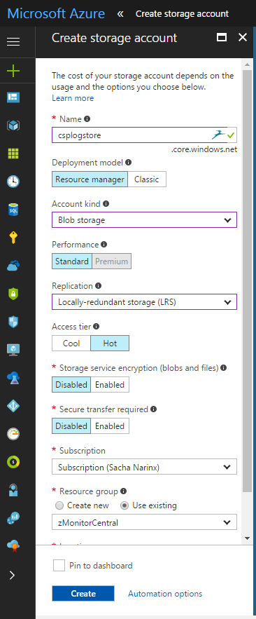
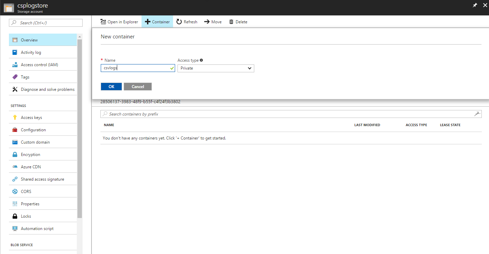
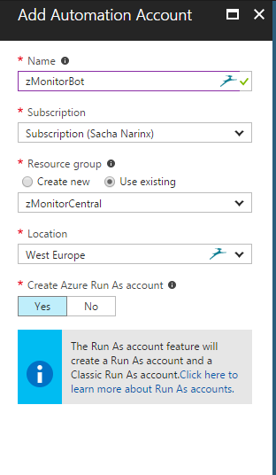
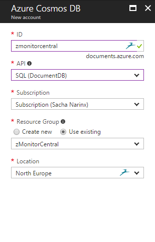
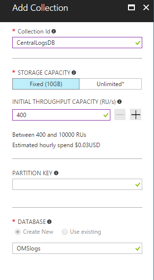
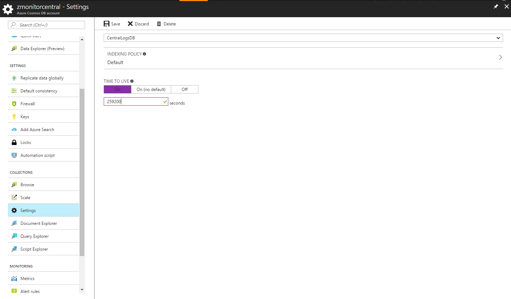
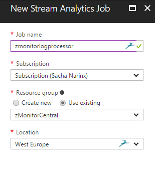
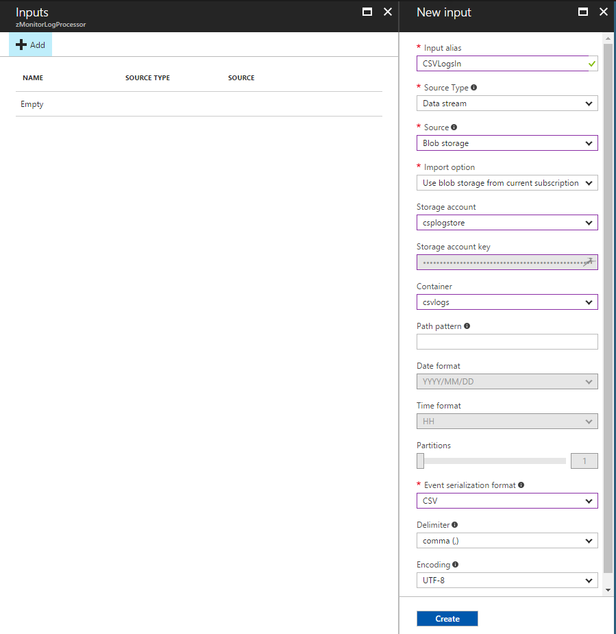
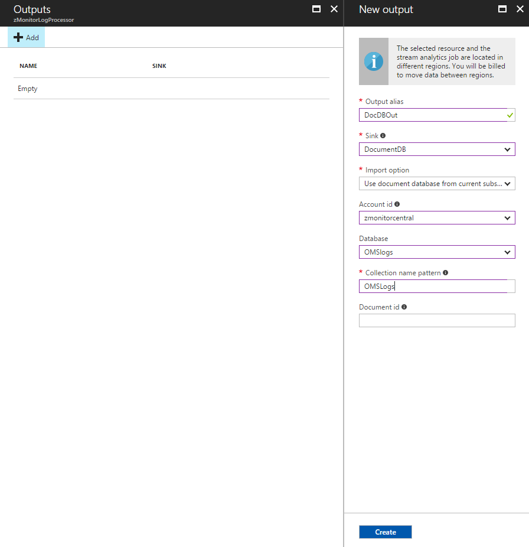
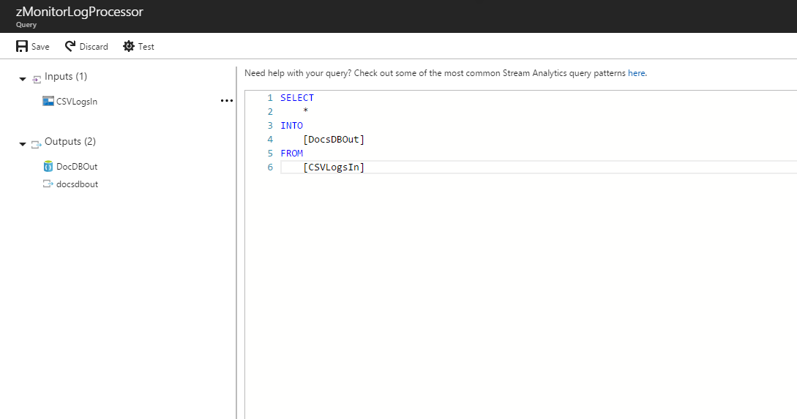

# zMonitor

## Service Provider / Central Deployment

Tenant / subscription operations monitoring is enabled through OMS Log Analytics. What you monitor and report on is dependent on the solutions and agents deployed, how monitoring is configured per workload in each tenant and the queries defined.

The service provider / central component of the solution is enabled using four core Azure components:

* Azure Storage Account
* Azure Automation
* Azure Stream Analytics
* Azure Cosmos DB

The overall process for tenant monitoring for the service provider is:


1. Receive tenant OMS logs as CSV in storage account container
1. Use Stream Analytics to move the CSV into Cosmos DB (formerly DocumentDB)
1. Run cleanup process through Azure Automation at least daily (cleans up the CSV container, and archives processed CSVs)
1. Visualize. This solution provides a work in progress PowerBI sample for viewing data. Viusalization can be done through any mechanism familiar to you, including existing tools as long as they can query Cosmos DB. PowerBI is provided for convenience as a starting point.

## Deployment

Below are the basic steps required to deploy the service provider component of the solution, provided as interim guidance while working on the ARM template (currently limited by stream analytics configuration).

What's needed to setup the service provider components of zMonitor.

* Storage Account (BLOBs)

  Storage for the CSV logs, Hot Locally Redundant (LRS) BLOB storage is sufficient. Cold may work but hasn't been tested.

  Create storage account:

  

  * Create two containers
    * Main logs container

      The container where the logs get dropped from subscriptions/tenants.

      

    * Archive logs container

      Long term retention of CSV logs, useful for later processing. Not directly required by this solution.

* Azure Automation

  Runs the CSV cleanup and archiving jobs. Create automation account:

  

  * Deploy runbook: [RB-Ops-CleanupDaily](deploy/serviceprovider/PS-Ops-CleanupDaily.ps1)
    * Schedule to run at least once a day, recommended to run every hour or two
    * Update storage details in RB-Ops-CleanupDaily:
    ```PowerShell
    $StorageAccountName = "<STORAGE ACCOUNT>"
    $StorageContainerName = "<MAIN CONTAINER NAME>"
    $TargetStorageContainerName = "<ARCHIVE CONTAINER NAME>"
    $StorageAccountKey = "<STORAGE ACCOUNT KEY>"
    ```
* Azure Cosmos DB

  Where the log data gets stored in JSON format, and where we report from. When querying Cosmos DB, we'll need the connection details, including the URI and key (read-only is sufficient) - both available under the "Keys" property under "Settings" on the Cosmos DB blade.

    * Create database

      

    * Create a collection (+ Add Collection)

      

    * Remember to set Time To Live (TTL) - recommended to set to 3 days (259200 seconds)

      This auto-deletes records in Cosmos DB older than what's specficied in the TTL setting. This keeps the collection size constrained  and query performance reasonable. Adjust this according to your specific requirements. Remember, the original data is archived in the BLOB archive container.

      

    * Scale according to number of tenants and query performance

    Start scale on a single partition with 400 RUs. Increase RUs as query performance is impacted. Data ingest should not be impacted at 400 RUs as we add data in short bursts. 

* Stream Analytics

  Create a new Stream Analytics job:

  

  * Configure input : storage account main logs container

    

  * Configure output : Cosmos DB collection

    

  * Define the query:
    ```SQL
    SELECT
        *
    INTO
        [CosmosDBCollection]
    FROM
        [StorageContainerCSVs]
    ```

    

  * Start the stream job

    

* Visualize - PowerBI
  * Configure connection to CosmosDB using URI and key (read-only)

    NOTE: Use the datasource connector "DocumentDB (Beta)"
